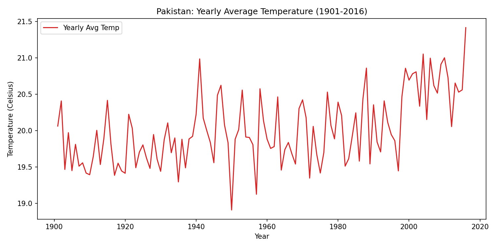
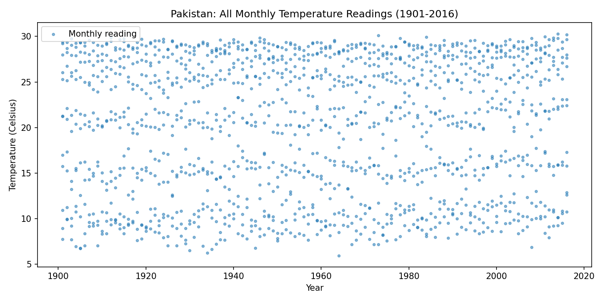
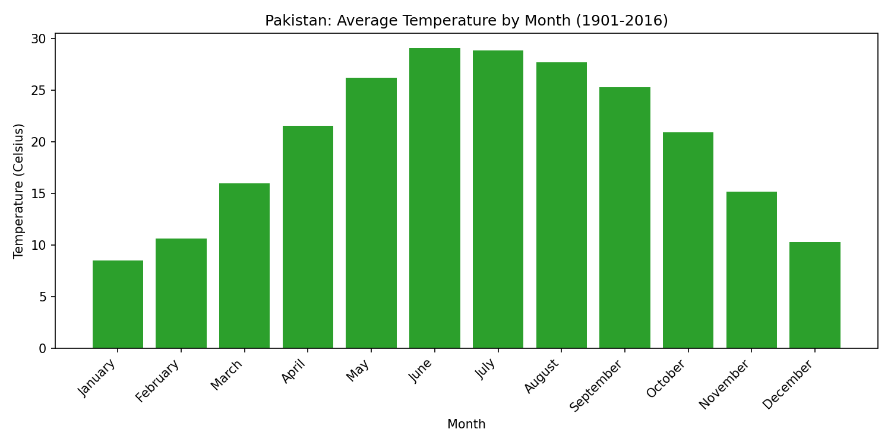

# AIC-301 Machine Learning Lab - Lab 01

Pakistan Average Temperature Analysis (1901–2016) using **Pandas** and **Matplotlib**.

Root project README for the [ML-LAB-1](https://github.com/samishahid516/ML-LAB-1) repository.

## Dataset

[Pakistan Average Temperature 1901–2016 (Kaggle)](https://www.kaggle.com/datasets) — monthly temperature readings in Celsius.

## Contents

- `lab01_ML/lab_task1.py` — Pandas data exploration
- `lab01_ML/lab_task2.py` — Matplotlib visualizations
- `lab01_ML/Tempreture_1901_2016_Pakistan.csv` — dataset

## Lab Tasks

### Task 1 — Pandas Data Exploration

`lab_task1.py` loads the CSV, cleans column names, and prints:

- First 5 rows
- Missing values per column
- Summary statistics (mean, median, max, min)
- Summer (Jun–Aug) average temperature
- Records after 2000 with temperature > 25 °C

### Task 2 — Matplotlib Visualizations

`lab_task2.py` generates three plots:







## Requirements

```
pandas
matplotlib
```

## Usage

```bash
cd lab01_ML
python lab_task1.py
python lab_task2.py
```
